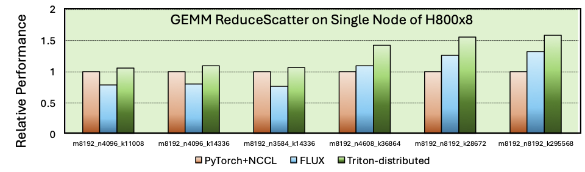
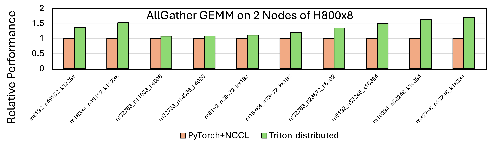
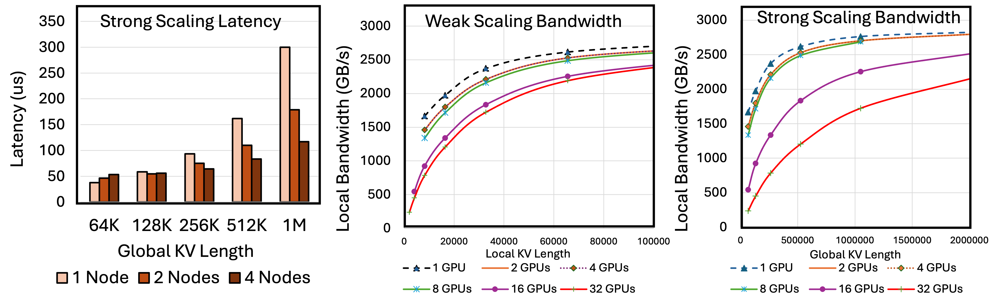

<div align="center">
 👋 大家好!
    <br>
    我们是 <b>ByteDance Seed team.</b>
</div>

<p align="center">
  欢迎通过以下方式以更好的了解我们👇
  <br>
  <a href="https://team.doubao.com/">
    </a>
  <a href="https://github.com/user-attachments/assets/93481cda-a7f3-47f3-b333-fe6b3da86b78">
    </a>
 <a href="https://www.xiaohongshu.com/user/profile/668e7e15000000000303157d?xsec_token=ABl2-aqekpytY6A8TuxjrwnZskU-6BsMRE_ufQQaSAvjc%3D&xsec_source=pc_search">
    </a>
  <a href="https://www.zhihu.com/org/dou-bao-da-mo-xing-tuan-dui/">
    </a>
</p>


# Triton-distributed
<!-- 
<p align="center">
  <a href="https://github.com/bytedance/flux">
    </a>
  <a href="https://arxiv.org/pdf/xxxx.xxxx">
    </a>
  <br>
  <a href="https://github.com/user-attachments/assets/d3fcb3bf-466b-4efe-8c3f-5f85258202ae">
    </a>
  <a href="XXX">
    </a>
</p> -->

[原始Triton README](upstream-README.md) | [英文README](README.md)

Triton-distributed是基于OpenAI Triton构建的分布式编译器，专为计算-通信重叠优化设计。

使用Triton-distributed，开发者可以创建性能媲美优化库（如NVIDIA的[Distributed-GEMM](https://github.com/NVIDIA/cutlass/tree/main/examples/65_distributed_gemm)和字节跳动的[FLUX](https://github.com/bytedance/flux/blob/main/README.md)）的高效Kernel。当前主要支持NVIDIA GPU和AMD GPU，也可移植到其他硬件平台。如需在自定义硬件上使用，请联系我们。

## 快速入门
### 源码安装

[安装指导](docs/distributed/build.md)

### 如何使用 Triton-distributed
Triton-distributed 提供了一套易于使用的原语，用于支持开发计算-通信融合的分布式kernel。这些原语分为低层次原语和高层次原语。目前，我们已经发布了低层次原语，并计划在未来发布高层次原语。

[Triton-distributed 原语](docs/distributed/primitives.md)

使用这些原语，用户可以轻松编写通信kernel。例如，以下展示了一个低延迟的AllToAll通信操作（在推理场景下，其延迟表现优于[DeepEP](https://github.com/deepseek-ai/DeepEP)）。这个例子在32卡H800集群中性能是137微秒（每个卡128 token, topk=8, hidden_size=7168, 数据类型是fp8），DeepEP是182微秒（DeepEP推理不用NVLink）
```py
@triton.jit
def all_to_all_kernel(
    data_src,
    data_dst,
    splits_src,
    splits_dst,
    signal,
    splits_cumsum,
    scale_src,
    scale_dst,
    rank: int,
    call_count: int,
    WITH_SCALE: tl.constexpr,
    WORLD_SIZE: tl.constexpr,
    HIDDEN: tl.constexpr,
    MAX_M: tl.constexpr,
    EXPERTS_PER_RANK: tl.constexpr,
    NUM_TOT_EXPERTS: tl.constexpr,
    ELEMENT_SIZE: tl.constexpr = 2,
    SCALE_ELEMENT_SIZE: tl.constexpr = 4,
):
    pid = tl.program_id(0)
    threadidx = tid(axis=0)

    exp_st = pid * EXPERTS_PER_RANK
    exp_ed = exp_st + EXPERTS_PER_RANK

    m_st = tl.load(splits_cumsum + exp_st)
    m_ed = tl.load(splits_cumsum + exp_ed)
    num_rows_cur_block = m_ed - m_st

    src_off = m_st
    dst_off = rank * MAX_M

    split_src_ptr = splits_src + exp_st
    off0 = exp_st + tl.arange(0, EXPERTS_PER_RANK)
    off1 = exp_st + tl.arange(0, EXPERTS_PER_RANK) + 1
    cumsum_sts = tl.load(splits_cumsum + off0)
    cumsum_eds = tl.load(splits_cumsum + off1)
    tl.store(split_src_ptr + tl.arange(0, EXPERTS_PER_RANK), cumsum_eds - cumsum_sts)

    act_pos = call_count % 2
    data_dst_ptr = data_dst + act_pos * WORLD_SIZE * MAX_M * HIDDEN + dst_off * HIDDEN
    split_dst_ptr = splits_dst + act_pos * NUM_TOT_EXPERTS + rank * EXPERTS_PER_RANK
    signal_ptr = signal + act_pos * WORLD_SIZE + rank

    libshmem_device.putmem_nbi_block(
        data_dst_ptr,
        data_src + src_off * HIDDEN,
        num_rows_cur_block * HIDDEN * ELEMENT_SIZE,
        pid,
    )
    libshmem_device.putmem_nbi_block(
        split_dst_ptr,
        split_src_ptr,
        EXPERTS_PER_RANK * 4,  # now we use `int32` for splits
        pid,
    )
    if WITH_SCALE:
        scale_dst_ptr = scale_dst + act_pos * WORLD_SIZE * MAX_M + dst_off
        libshmem_device.putmem_signal_nbi_block(
            scale_dst_ptr,
            scale_src + src_off,
            num_rows_cur_block * SCALE_ELEMENT_SIZE,
            signal_ptr,
            call_count,
            libshmem_device.NVSHMEM_SIGNAL_SET,
            pid,
        )

    libshmem_device.fence()
    if threadidx == 0:
        if not WITH_SCALE:
            libshmem_device.signal_op(
                signal_ptr,
                call_count,
                libshmem_device.NVSHMEM_SIGNAL_SET,
                pid,
            )
        libshmem_device.signal_wait_until(
            signal + act_pos * WORLD_SIZE + pid,
            libshmem_device.NVSHMEM_CMP_EQ,
            call_count,
        )
```

此外，用户可以将通信部分与计算部分结合，设计计算-通信融合的kernel。我们在`third_party/distributed/distributed/kernels`目录下提供了示例实现。

## Performance
Triton-distributed 可以达到和手写分布式算子库接近的性能，有时候还能更好。


### AllGather GEMM 单机H800


### GEMM ReduceScatter 单机H800


### AllGather GEMM 双机H800


### GEMM ReduceScatter 双机H800


### 分布式Flash-Decode从单机到四机扩展情况


### 其他平台性能
[AMD GPUs](docs/distributed/amd-perf.md)

## Roadmaps
### 功能
- [x] Release low-level primitives
- [ ] Release high-level primitives
- [ ] Tutorials
- [ ] Pre-built binary
### Kernels
- [x] Release single-node GEMM TP overlapping kernels
- [x] Release single-node MoE TP overlapping kernels
- [x] Release single-node distributed Flash-Decoding kernels
- [ ] Release single-node MoE EP overlapping kernels
- [x] Release cross-node GEMM TP overlapping kernels
- [x] Release cross-node MoE TP overlapping kernels
- [x] Release cross-node distributed Flash-Decoding kernels
- [x] Release cross-node EP all-to-all kernels (similar to [DeepEP](https://github.com/deepseek-ai/DeepEP))
- [ ] Provide tutorials for kernel implementation
### 后端
计算能力
- [x] Nvidia SM90a support
- [x] Nvidia SM80 support
- [x] Nvidia SM89 support
- [x] AMD CDNA3 support

通信能力
- [x] NVLink
- [x] IB
- [ ] PCIe 

### 性能
- [ ] Performance report

## 许可协议
Triton-distributed 主体是 MIT license.
我们的代码中有一些是 Apache-2.0 License的:
- `third_party/distributed/distributed/kernels/flash_decode.py`

Triton原本又些代码也是 Apache-2.0 License的:
- `include/triton/Dialect/TritonGPU/Transforms/PipelineExpander.h`
- `lib/Dialect/TritonGPU/Transforms/Pipeliner/PipelineExpander.cpp`
- `python/triton/_C/include/triton/Dialect/TritonGPU/Transforms/PipelineExpander.h`
- `utils/generate-test-checks.py`

## 引用
如在学术研究中使用Triton-distributed，请引用：
```bibtex
@misc{zheng2025tilelink,
      title={TileLink: Generating Efficient Compute-Communication Overlapping Kernels using Tile-Centric Primitives},
      author={Size Zheng and Jin Fang and Xuegui Zheng and Qi Hou and Wenlei Bao and Ningxin Zheng and Ziheng Jiang and Dongyang Wang and Jianxi Ye and Haibin Lin and Li-Wen Chang and Xin Liu},
      year={2025},
      eprint={TBD},
      archivePrefix={MLSys}
}
```

# 关于 [ByteDance Seed Team](https://team.doubao.com/)

字节跳动Seed团队成立于 2023 年，致力于打造行业内最先进的人工智能基础模型。该团队立志成为世界一流的研究团队，并为科学进步和社会发展做出重大贡献。

---

# 交流与讨论

